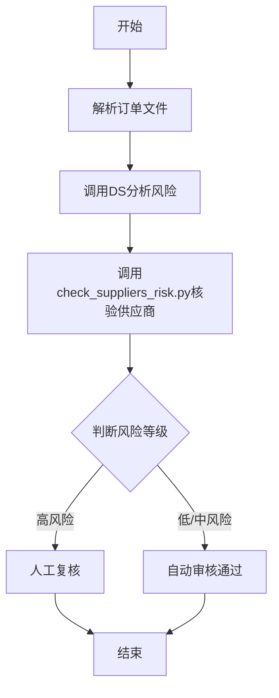

```mermaid
graph TD
    A[开始] --> B[解析订单文件]
    B --> C[调用DS分析风险]
    C --> D[调用check_suppliers_risk.py核验供应商]
    D --> E{判断风险等级}
    E -->|高风险| F[人工复核]
    E -->|低/中风险| G[自动审核通过]
    F --> H[结束]
    G --> H
```